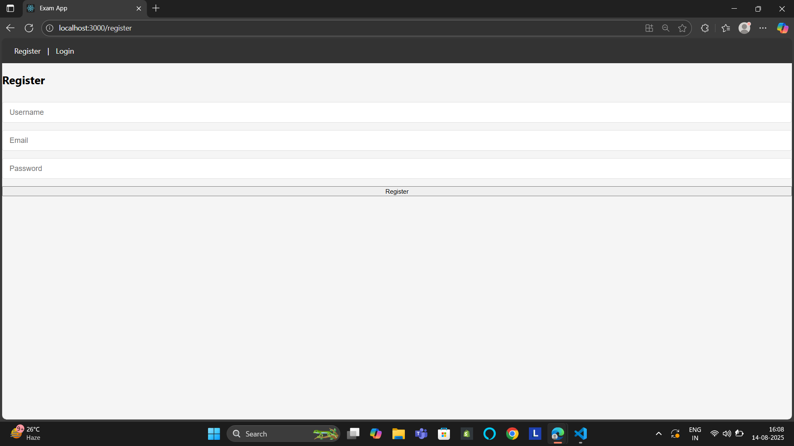

# 📝 Online Exam App  
A full-stack **MERN** (MongoDB, Express, React, Node.js) based exam application where users can register, log in, take a timed exam with random questions, and receive instant grading results.

---

## 🚀 Features
- 🔐 **User Authentication** (JWT-based login & registration)
- 🎯 **Randomized Questions** from MongoDB
- ⏳ **Exam Timer** (auto-submit when time runs out)
- 📊 **Instant Grading** with score & percentage
- 🔄 **Retake Exam** option
- 🖥 **Responsive UI** built with React

------

# 📷 Screenshots

### 1. Registration Page


### 2. Login Page


### 3. Start Exam Page


### 4. Exam Interface


### 5. Results Page


--

## 🛠 Tech Stack
**Frontend:**
- React.js
- React Router
- CSS

**Backend:**
- Node.js
- Express.js
- MongoDB + Mongoose
- JWT Authentication
- bcrypt.js (Password Hashing) 

---

## ⚙️ Installation & Setup

### 1️⃣ Clone the repository
```bash
git clone https://github.com/Mohammed-bm/exam-app.git
cd exam-app

Backend Setup
cd backend
npm install

Create a .env file inside backend/:
PORT=YOUR_PORT
MONGO_URI=YOUR_MONGO_URI
JWT_SECRET=your_jwt_secret_here

Run backend:
npm start

Frontend Setup
cd ../frontend
npm install
npm start

---

🧪 API Testing with Postman

Steps:

Open Postman
Click Import
Select the file: postman/exam-api.postman_collection.json

Test the APIs in this order:
POST /api/auth/register
POST /api/auth/login (copy the token from the response)
GET /api/exam/start-exam (use token in Authorization: Bearer <token>)
POST /api/exam/submit-exam
