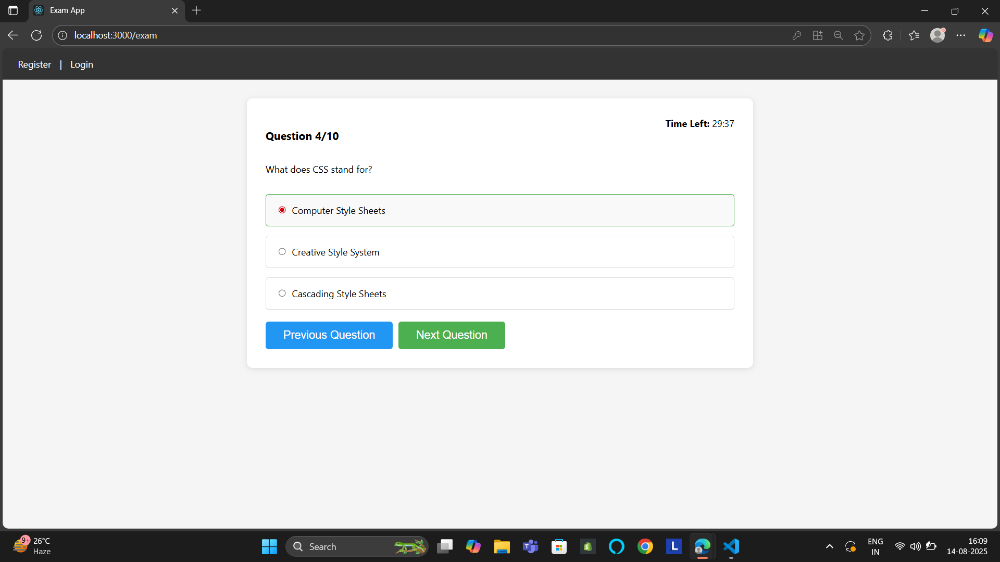

# 📝 Online Exam App

A full-stack **MERN** (MongoDB, Express, React, Node.js) based exam application where users can register, log in, take a timed exam with random questions, and receive instant grading results.

---

## 🚀 Features
- 🔐 **User Authentication** (JWT-based login & registration)
- 🎯 **Randomized Questions** from MongoDB
- ⏳ **Exam Timer** (auto-submit when time runs out)
- 📊 **Instant Grading** with score & percentage
- 🔄 **Retake Exam** option
- 🖥 **Responsive UI** built with React

---

## 📷 Screenshots

### 1. Registration Page
 

### 2. Login Page


### 3. Start Exam Page


### 4. Exam Interface


### 5. Results Page


---

## 🛠 Tech Stack
**Frontend:**
- React.js
- React Router
- CSS

**Backend:**
- Node.js
- Express.js
- MongoDB + Mongoose
- JWT Authentication
- bcrypt.js (Password Hashing) 

---

## 📂 Project Structure
exam-app/
│
├── backend/
│   ├── config/
│   │   └── db.js
│   ├── middleware/
│   │   └── authMiddleware.js
│   ├── models/
│   │   ├── Question.js
│   │   └── User.js
│   ├── routes/
│   │   ├── auth.js
│   │   └── exam.js
│   ├── seedQuestions.js
│   ├── server.js
│   ├── .env
│   ├── package.json
│   └── package-lock.json
│
├── frontend/
│   ├── public/
│   ├── src/
│   │   ├── components/
│   │   │   └── ProtectedRoute.js
│   │   ├── pages/
│   │   │   ├── Exam.js
│   │   │   ├── Login.js
│   │   │   ├── Register.js
│   │   │   ├── Result.js
│   │   │   └── StartExam.js
│   │   ├── App.css
│   │   ├── App.js
│   │   ├── api.js
│   │   ├── index.css
│   │   └── index.js
│   ├── package.json
│   └── package-lock.json
│
├── screenshots/
│   ├── register.png
│   ├── login.png
│   ├── start-exam.png
│   ├── exam.png
│   └── results.png
│
├── README.md
└── .gitignore

## ⚙️ Installation & Setup

### 1️⃣ Clone the repository
```bash
git clone https://github.com/Mohammed-bm/exam-app.git
cd exam-app

# Install backend dependencies
cd backend
npm install

# Install frontend dependencies
cd ../frontend
npm install